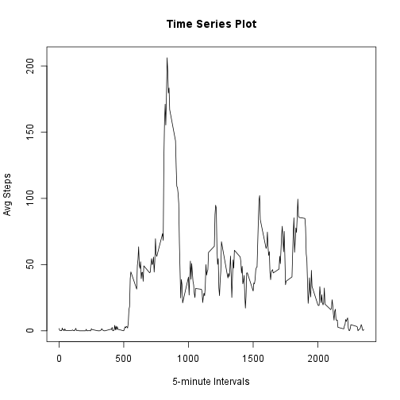
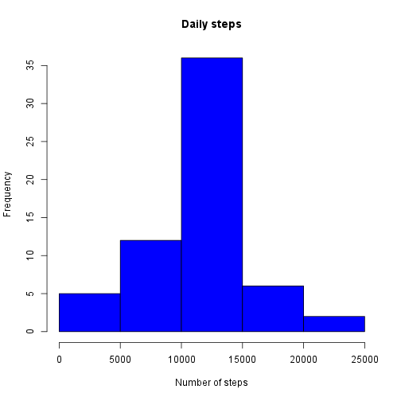

## Introduction

The data for this assignment can be downloaded from the course web
site:

* Dataset: [Activity monitoring data](https://d396qusza40orc.cloudfront.net/repdata%2Fdata%2Factivity.zip) [52K]

The variables included in this dataset are:

* **steps**: Number of steps taking in a 5-minute interval (missing
    values are coded as `NA`)

* **date**: The date on which the measurement was taken in YYYY-MM-DD
    format

* **interval**: Identifier for the 5-minute interval in which
    measurement was taken

## Loading and preprocessing the data


Load the data:

```r
if(!file.exists('activity.csv')){
    unzip('activity.zip')
}
activity <- read.csv('activity.csv',
                sep=",",
                na.strings = "NA",
                colClasses =c("numeric","Date","numeric"))
```


## What is mean total number of steps taken per day?

Calculation sum of steps per day and histogram figure:

```r
step_day <- tapply(activity$steps,activity$date,sum)
hist(step_day, breaks = 15, col="blue",xlab="Number of Steps", main="Daily Steps")
```

 

Mean and median calculation:


```r
step.mean <- mean(step_day, na.rm=TRUE)
step.median <- median(step_day, na.rm=TRUE)
```

The mean value is 1.0766189 &times; 10<sup>4</sup>.

The median value is 1.0765 &times; 10<sup>4</sup>.

## What is the average daily activity pattern?

Calculation average steps per interval and plot:


```r
avgStepsInt <- tapply(activity$steps,activity$interval,mean, na.rm=TRUE)
plot(names(avgStepsInt), avgStepsInt, type="l", main = "Time Series Plot", xlab="5-minute Intervals", ylab="Avg Steps")
```

 

```r
max.step <- as.numeric(names(which.max(avgStepsInt)))
```

5 min interval max is 835.

## Imputing missing values

Calculation number missing values:


```r
missing <- sum(is.na(activity))
```

There are 2304 missing values in the dataset. 

New data set with missing values substituted by the step interval average:


```r
activityNoNA <- activity

meanInterval <-tapply(activity$steps, activity$interval,mean, na.rm=TRUE)

for (i in which(is.na(activityNoNA)))
    {
    activityNoNA[i,1] <- meanInterval[((i-1)%%288)+1]
    }
hist(tapply(activityNoNA$steps,activityNoNA$date,sum), col="blue",main = "Daily steps", xlab="Number of steps")
```

 


```r
step.mean <- mean(step_day, na.rm=TRUE)
step.median <- median(step_day, na.rm=TRUE)
```

The mean value is 1.0766189 &times; 10<sup>4</sup>.

The median value is 1.0765 &times; 10<sup>4</sup>.

Mean and median values are the same than before.

## Are there differences in activity patterns between weekdays and weekends?


